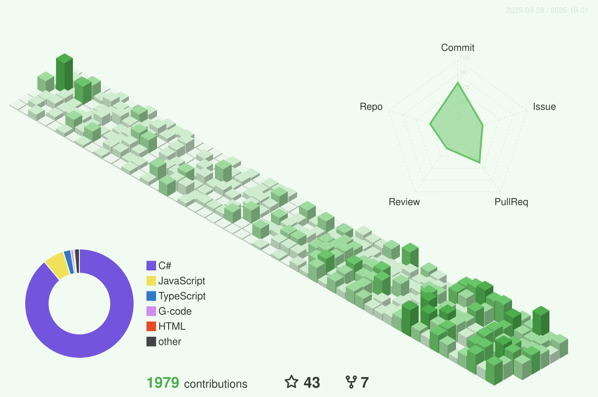

<!-- Each <picture> serves a dark or light image based on the visitor's GitHub theme -->

# Anwar Minarso

Software Engineer · Full-Stack · Cloud · IoT

<a href="https://linkedin.com/in/anwarminarso">LinkedIn</a> ·
<a href="https://x.com/anwarminarso">X</a> ·
<a href="https://instagram.com/anwarminarso">Instagram</a> ·
<a href="https://facebook.com/anwarminarso">Facebook</a>

  

<picture><source media="(prefers-color-scheme: dark)" srcset="https://skillicons.dev/icons?i=cs%2Cdotnet%2Ccpp%2Cpy%2Cjs%2Creact%2Cangular%2Cazure%2Caws%2Cgcp%2Craspberrypi%2Cpostgres&theme=dark" /></picture><picture><source media="(prefers-color-scheme: dark)" srcset="./icons/sqlserver.svg" /></picture>

  
<b>Full tech stack</b>

   
  <picture><source media="(prefers-color-scheme: dark)" srcset="https://skillicons.dev/icons?i=cs%2Ccpp%2Cc%2Cpy%2Cjs%2Cphp%2Chtml%2Ccss%2Cdotnet%2Cangular%2Creact%2Cnodejs%2Cbootstrap%2Cgit%2Cgithubactions&theme=dark" /></picture> 
  <picture><source media="(prefers-color-scheme: dark)" srcset="https://skillicons.dev/icons?i=azure%2Caws%2Cgcp%2Ccloudflare%2Cfirebase%2Cnginx%2Craspberrypi%2Cps%2Cpostgres%2Cmysql%2Cmongodb%2Credis%2Csqlite&theme=dark" /></picture><picture><source media="(prefers-color-scheme: dark)" srcset="./icons/sqlserver.svg" /></picture>
   
  Also: Blazor · Xamarin · React Native · MariaDB · MQTT (Mosquitto) · Linode · OpenAPI

 

 

<picture>
  <source media="(prefers-color-scheme: dark)" srcset="https://github-readme-stats.vercel.app/api?username=anwarminarso&show_icons=true&include_all_commits=true&count_private=false&theme=github_dark&bg_color=00000000&hide_border=true" />
  
</picture>
<picture>
  <source media="(prefers-color-scheme: dark)" srcset="https://streak-stats.demolab.com/?user=anwarminarso&theme=dark&background=00000000&hide_border=true" />
  
</picture>

